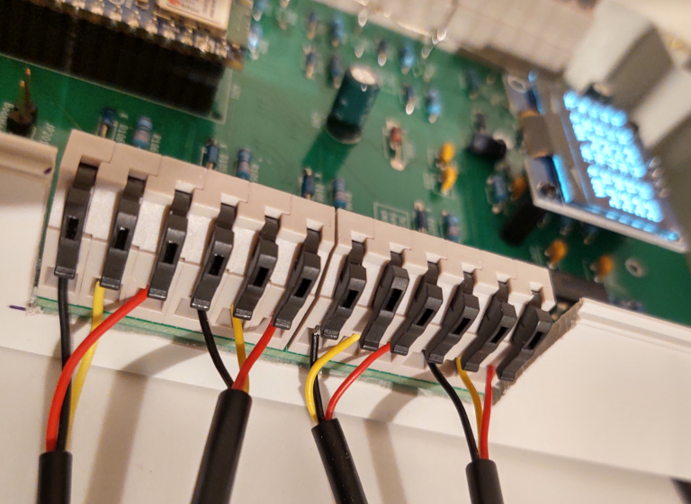
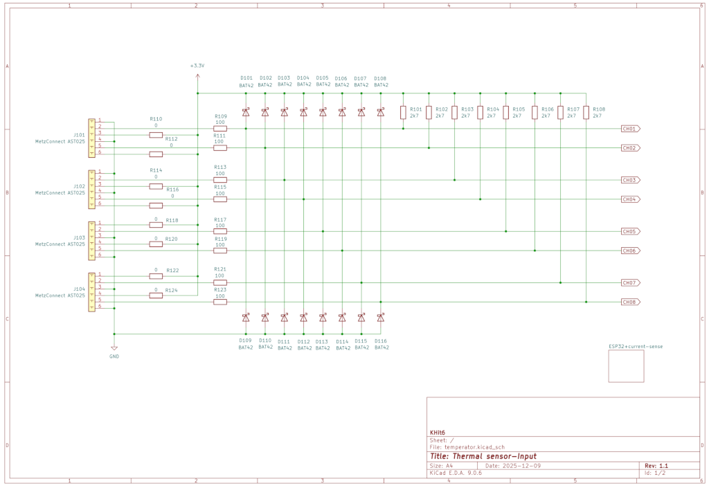
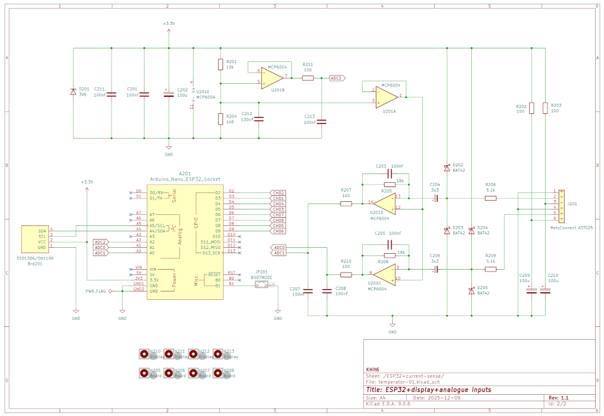
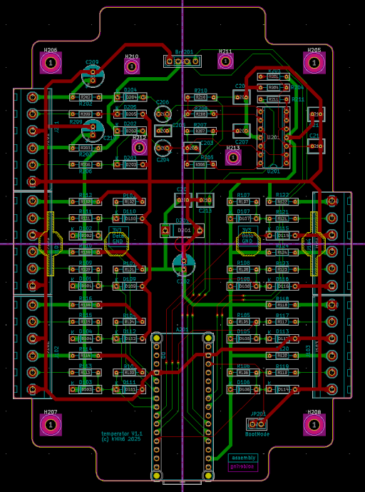
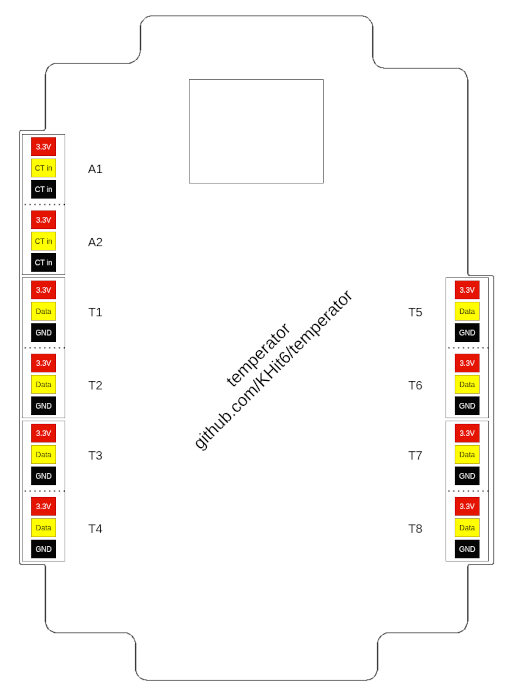

# temperator 
## Smart connected device to measure 8 temperatures and 2 AC currents

temperator is a robust and easy-to-use measurement system for taking 8 temperatures and 2 AC currents. Its design is simple yet professional. No special knowledge is required for operation. In addition to the hardware, a configuration for operation with [ESPHome](https://esphome.io/) is provided in a [separate repository](https://github.com/KHit6/temperator-esphome/). This makes integration with [Home Assistant](https://www.home-assistant.io/) or other home automation systems very easy. Besides legacy Home Assistant connectivity, MQTT as interface protocol is also supported.

Each measurement channel is handled individually. This avoids the very common incompatibilities and difficulties in use when connecting multiple OneWire sensors together. E.g. it takes less than one minute to exchange a sensor - no more struggling with DS18B20's unique ids. Sensors with a cable length of more than 10 meters can be used without any problems. To adjust to the CT's type you can set a separate gain for each current transformer.

Particular emphasis was placed on ease of use and robust operation and favorable overall costs. A 2-layer board was sufficient for the PCB.

Further design goals of this project included:

 * Provides 8 individual channels to acquire temperatures with very common DS18B20 sensors
 * Provides 2 channels to acquire AC current values with common current transformers
 * Provides an on-board display for quick viewing of temperatures and currents
 * Use of an available ESP32 development board with a least second source available 
 * Use of terminal clamps to connect sensors without any tools
 * The terminal clamps allows to use stranded wires
 * Protect all inputs against ESD damages
 * No handling of mains voltage necessary
 * The board's design fits in an of the shelf case
 * Use common and available components – although is has to be a THT design to get it produced in very small quantities or by DIY hobbyists
 * Offers ESPHOME-generated software for connecting either to Home Assistant or via MQTT to other home automation systems

As micro-controller an [Arduino Nano ESP32](https://docs.arduino.cc/hardware/nano-esp32/) is used. This, or compatible models, offer sufficient resources to program even more complex control systems. It also allows the use of MicroPython, alternatively. Maybe, but that was no design goal, other Arduino Nanos can be used as well.

Here are some impressions of a fully assembled temperator:

## Some Hints
 * The CT's bandpass filter stage is calculated according this [tutorial](https://www.electronics-tutorials.ws/de/filtern/aktiver-bandpassfilter.html). AC voltage input and hence output of the transformer is assumed to be 1 Vpp. The intended gain is 3.83 and the cutoff frequencies are about 90 Hz and 10 Hz
 * The display must have its pins in the order GND, VCC, SCL, SDA. Caution, you can buy displays with the same name but different GND VCC orders
 * The board offers the flexibility to use two different display sizes. Two diagonally opposite screw fixings are provided for each size. Unfortunately there is no "standard" with this kind of display modules, so sometimes the screw holes may not match.
 * With an Arduino board you must not assemble the "Boot" pin header
 * The current transformer inputs can alternatively be used for other analogue AC signals than signals from current transformers
 * Each analogue input provide a low current 3.3V voltage source to supply external circuits
 * The bill of material (BOM) is enhanced with all mechanical parts like screws, stands and the case

## Todos
 * Currently temperator (Version V1.1) source all voltages to the temperature sensors directly from the ESP32 module's voltage regulator. There must be  protection circuit built in to protect the regulator.
 * Very rare DS18B20 cease to send data. It would be helpful if the supply voltage of the sensors can be remotely switched off and on again to restart the sensors.

As EDA system KiCAD 9.06 was used (Great EDA tool).

temperator is subject to the "CERN OHL V2 Weakly License".
